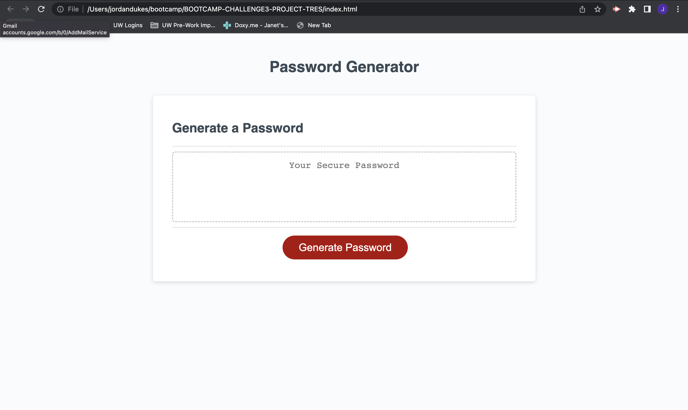

# Random Password Grenerator Created by Jordan Dukes

## Description

This is a unique password generator created by me which is to be used to create encripted passwords that no one will guess. This program can be used by anyone with the need for a password when it comes the time that you are out of options. Please be aware that depending on the answers to the prompts, a generated password should match to that specific design.

## Installation

N/A

## Usage

This program is very simple to use and understand. First the user must 'click' the "generate password" button. This will then send the user to a series of questions which will ask what the encrypted password should be. The user should also be aware that this generator only compiles passwords in length of 8-128. If the length is not chosen correctly, the system will revert you back to the start. Once the series of questions are answered by the user, then a password containing the chosen characters will appear. Below is a referenced screenshot which display the first page of the password generator. You will notice the giant red button that should be clicked to start the process. Enjoy making a bunch of untrackable passwords!

## Credits

N/A

## Link

https://jlddukes.github.io/BOOTCAMP-CHALLENGE3-PROJECT-TRES/